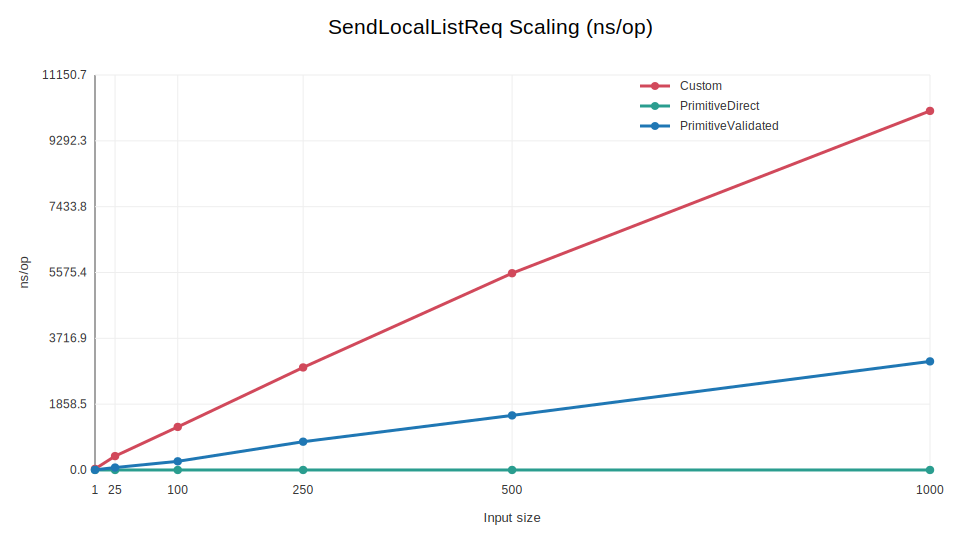
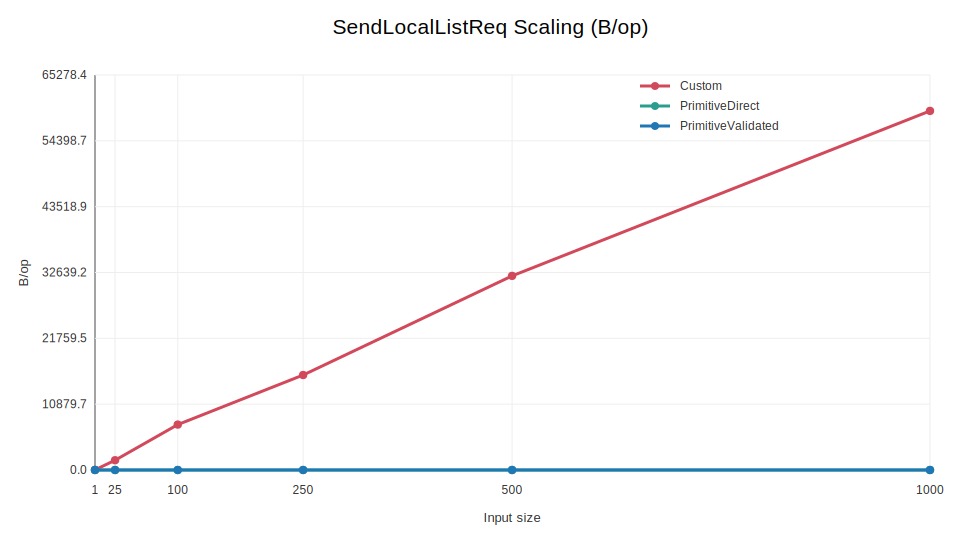
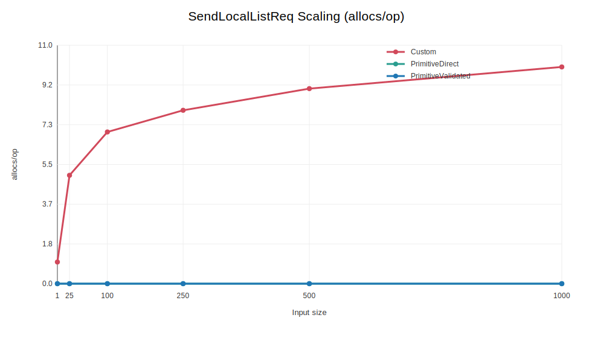
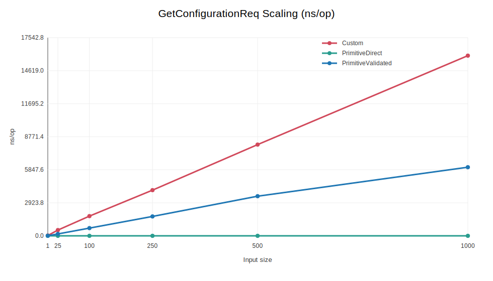
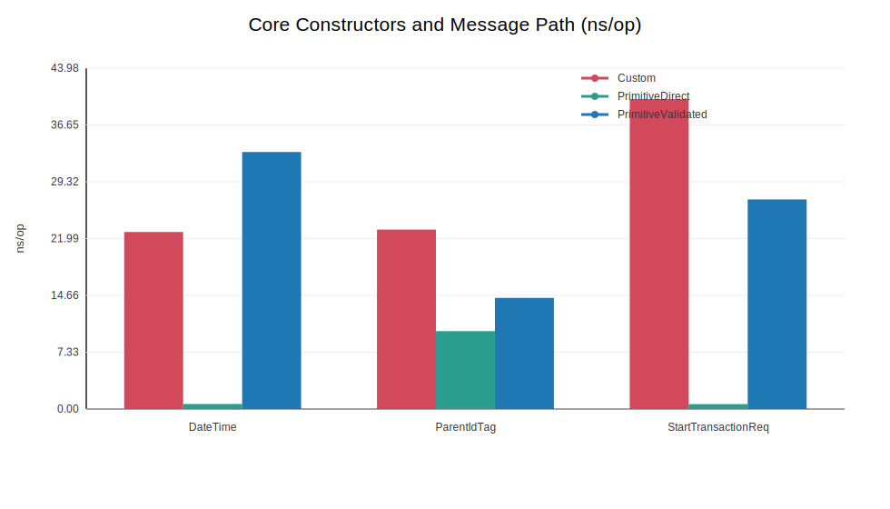
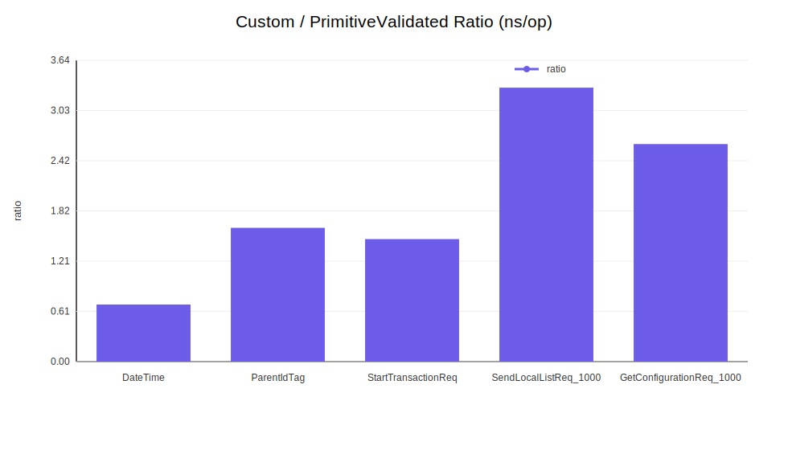

# Benchmark Report: Custom Types vs Primitives

This report is generated from benchmarks in `analysis_benchmak` and charts
in `docs/img/`.

## How To Reproduce

```sh
go run ./scripts/benchreport.go
```

## Scope

- Core constructors: `DateTime`, `ParentIdTag`, `StartTransactionReq`
- Scaling path #1: `SendLocalListReq` (1 to 1000 entries)
- Scaling path #2: `GetConfigurationReq` (1 to 1000 keys)
- Metrics: `ns/op`, `B/op`, `allocs/op`

## Charts

### 1) SendLocalListReq Scaling (ns/op)



### 2) SendLocalListReq Scaling (B/op)



### 3) SendLocalListReq Scaling (allocs/op)



### 4) GetConfigurationReq Scaling (ns/op)



### 5) Core Constructors and Message Path (ns/op)



### 6) Custom / PrimitiveValidated Ratio (ns/op)



## Key Numbers

| Case | Custom ns/op | PrimitiveValidated ns/op | Ratio |
| ---- | -----------: | -----------------------: | ----: |
| SendLocalListReq_1000 | 10137.00 | 3066.00 | 3.31x |
| GetConfigurationReq_1000 | 15948.00 | 6074.00 | 2.63x |
| StartTransactionReq | 39.98 | 27.04 | 1.48x |

## Analysis

1. `PrimitiveDirect` is the fastest baseline because it skips validation.
2. Against a fair baseline (`PrimitiveValidated`), custom types add
   bounded overhead but keep all OCPP validation centralized.
3. As input size grows, custom and validated primitive lines trend
   similarly (same O(n) shape), which means scaling behavior is
   predictable.
4. Allocation charts show where object wrapping adds memory cost; this
   is measurable but small compared to typical network/JSON costs in
   end-to-end OCPP flows.

## Conclusion

Using first-class datatypes is a speed vs safety tradeoff. If you want
maximum raw microbenchmark speed, direct primitives win. If you want
stronger correctness guarantees, clearer APIs, and less repeated
validation logic, custom datatypes provide a practical and predictable
cost profile.
